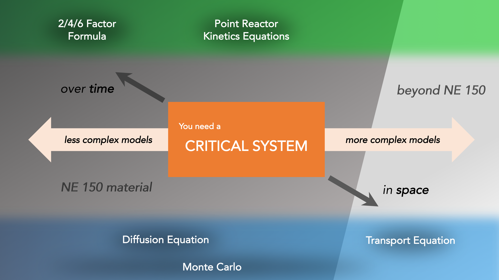
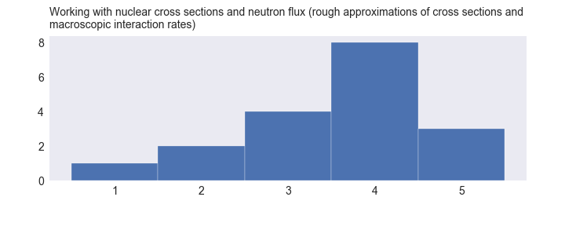
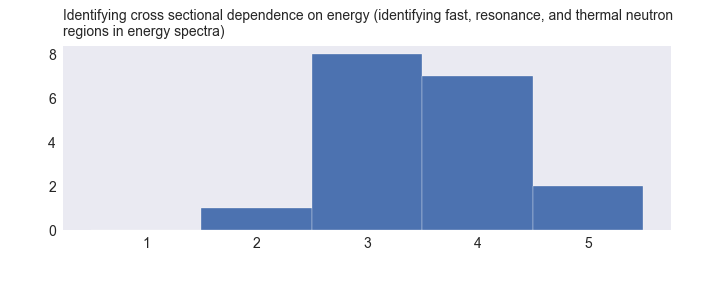
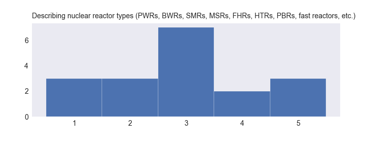
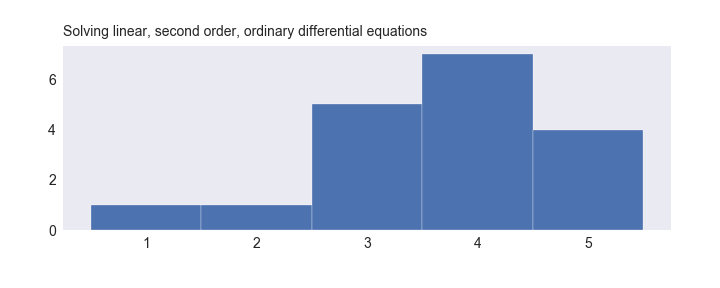
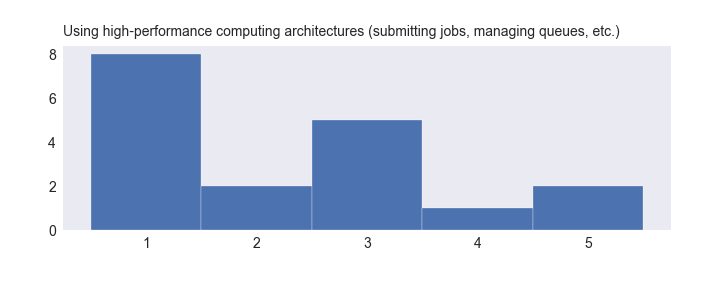

Welcome to the homepage for the discussion section of NE 150, UC Berkeley's introductory course on Nuclear Reactor Theory!
This website contains some [basic info](NE150-Disc_2018_Syllabus.md) about discussion sections, and may be updated with useful resources throughout the semester.

I will do my best to keep [bcourses](https://bcourses.berkeley.edu/courses/1468265/files/folder/Discussion%20Section) up-to-date with changes to any and all documents posted on this site, but since this repository will be linked to my own local copy of all files, you can always find the most recent versions of any file here.

Check back often for updates, and good luck! 

&emsp;&emsp;&emsp;&emsp;&emsp;&emsp;&emsp;&emsp;&emsp;&emsp;&emsp;&emsp;&emsp;&emsp;&emsp;&emsp;&emsp;&emsp;&emsp;&emsp;&emsp;&emsp;&emsp;&emsp;&emsp;  _Mitch Negus, GSI Spring 2018_

---

# A bit about the course structure
NE 150 primarily focuses on ways to model nuclear reactors–or more generally critical nuclear systems. Critical systems are those where the neutron production exactly balances the neutron loss. In the systems we will consider, neutron production most frequently occurs in nuclear fission events and neutron loss occurs when a neutron is absorbed or escapes from the system. Reactors are critcal because these reactions are sustained. If our system was subcritical, with more neutron loss than production, it would simply be an expensive hunk of decaying actinide. If our system was supercritical, it would be a serious accident, or in the extreme case, a weapon. 

Over the course of the semester, our objective will be to learn a variety of different models that can describe these systems. As we move through the material, it can be difficult to understand exactly why we're learning certain concepts and techniques, and how they relate to the larger objective. To help some of this make sense, I like to think of NE 150 using the following graph. 

First off, we start in the middle of the graph, where our primary motive–modeling critical systems–is highlighted. Now, I've structured this chart in such a way that simpler models are placed on the left side, and as we move to the right we have more complicated models. I consider these models in two main types: models over time on top in the green continuum, models in space down bottom in the blue continuum. 

Be aware that this is how _I_ like to consider these models as they are treated in _this_ class; in reality, you could add time-dependence to the diffusion or transport equation.

As the arrows indicate, we will start in each region towards opposite ends of the continuum for the two model types. For modeling reactors over time, we will start with the very simple (in fact, basically time independent) two, four, and six factor formulas where we imagine our reactor as nothing more than a point in space. I consider this as a model over time, however, because the equation is governed by rates (fission rates, absorption rates, leakage rates, etc.). These equations will give us a very rudimentary idea of the performance of a given system, but we will find it too simple for modeling more complicated time-dependent behavior. We will therefore develop the point reactor kinetics equations to describe reactors more completely.

On the flip side, we will very briefly discuss the neutron transport equation as a method of determining the spatial neutron behavior of our system. As you can see by the gray background shading in the chart, full discussion of this equation is left to NE 250, the graduate version of this course. Instead, we will make some very convenient approximations to the transport equation, and arrive at the neutron diffusion equation. For many simple systems, this equation will suffice for getting a rough picture of how many neutrons are at any given point in our reactor. In fact, the equation does well enough that it has been used to model many of the reactors built in the 20th century, when computational capabilities were not sufficient to perform the more complicated transport calculations. 

Around the midpoint of the semester we will also discuss Monte Carlo algorithms, which allow us to gain similar insights as we get from the transport and diffusion equations. Whereas the transport and diffusion equation were deterministic, with neutronics calculated from advance knowledge of fission, scattering, and absorption rates at every other point in the system, Monte carlo methods are stochastic. These are methods that generate particles and track them through their lifeimte, using random values pulled from established probability distributions. With an adequately descriptive model and enough particles, these methods will accurately approximate the system. The complexity of a Monte Carlo algorithm is entirely dependent on the specific model used, and so I've tried to indicate that its horizontal position on the chart is less certain than other methods.

### Course Resources
[NE 150 Lecture (Spring 2018) Syllabus](NE150_2018_Syllabus.pdf)  
[NE 150 Lecture (Spring 2018) Schedule](NE150_2018_Schedule.pdf)

### NE 150 Pre-survey

[NE 150 Discussion (Spring 2018) Pre-Survey](https://goo.gl/forms/1gLAzCfnptbH8Cki1)  

Results of the anonymous pre-survey from spring 2018. Ratings were collected for familiarity with a set of topics and exercises corresponding to course prerequisites. The scale was:

1. I have never heard of this.
2. I have heard of this but don't know what it is
3. I learned about it this once but don't remember it
4. I can do this.
5. Do we have to learn this again?

    
    

    
    

    
    

    
    

    
    

    
    

    
    

    
    

    
    

    
    

    
    

    
    

    
    

    
    

    
    

    
    

    
    

