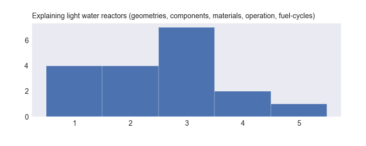

Welcome to the homepage for the discussion section of NE 150, UC Berkeley's introductory course on Nuclear Reactor Theory!
This website contains some [basic info](NE150-Disc_2018_Syllabus.md) about discussion sections, and may be updated with useful resources throughout the semester.

I will do my best to keep [bcourses](https://bcourses.berkeley.edu/courses/1468265/files/folder/Discussion%20Section) up-to-date with changes to any and all documents posted on this site, but since this repository will be linked to my own local copy of all files, you can always find the most recent versions of any file here.

Check back often for updates, and good luck! 

&emsp;&emsp;&emsp;&emsp;&emsp;&emsp;&emsp;&emsp;&emsp;&emsp;&emsp;&emsp;&emsp;&emsp;&emsp;&emsp;&emsp;&emsp;&emsp;&emsp;&emsp;&emsp;&emsp;&emsp;&emsp;  _Mitch Negus, GSI Spring 2018_

---

### Course Resources
[NE 150 Lecture (Spring 2018) Syllabus](NE150_2018_Syllabus.pdf)  
[NE 150 Lecture (Spring 2018) Schedule](NE150_2018_Schedule.pdf)

### NE 150 Pre-survey

[NE 150 Discussion (Spring 2018) Pre-Survey](https://goo.gl/forms/1gLAzCfnptbH8Cki1)  
[NE 150 Discussion (Spring 2018) Pre-Survey Results](surveys/presurvey_2018.md)

Results of the anonymous pre-survey from spring 2018. Ratings were collected for familiarity with a set of topics and exercises corresponding to course prerequisites. The scale was:

1. I have never heard of this.
2. I have heard of this but don't know what it is
3. I learned about it this once but don't remember it
4. I can do this.
5. Do we have to learn this again?

    
    

    
    

    
    

    
    

    
    

    
    

    
    

    
    

    
    

    
    

    
    

    
    

    
    

    
    

    
    

    
    

    
    

