# NE 150 Pre-survey

Results of the anonymous pre-survey given to the UC Berkeley Nuclear Engineering 150 course, given in spring 2018. Students were asked to rate their level of familiarity with a set of topics and exercises corresponding to course prerequisites. The scale was:

1. I have never heard of this.
2. I have heard of this but don't know what it is
3. I learned about it this once but don't remember it
4. I can do this.
5. Do we have to learn this again?


```python
# Programmatic overhead
import pandas as pd
import seaborn as sns
from matplotlib import pyplot as plt
```


```python
# Load data from a csv, downloaded from the Google Form
survey_data = pd.read_csv('NE150_2018_Presurvey.csv')
```


```python
# Loop through questions and plot scale
for question in survey_data.columns[1:]:
    fig,ax = plt.subplots(figsize=(10,4))
    survey_data[question].hist(bins=[1,2,3,4,5,6],align='left',edgecolor='white')
    ax.text(0,1.05,s=question,fontsize=14,transform=ax.transAxes)
    ax.tick_params(labelsize='14')
    ax.grid(False)
    plt.show()
    print('\n')
```


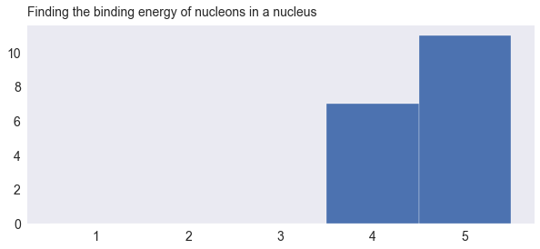


    
    


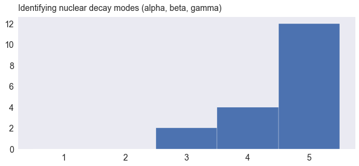


    
    


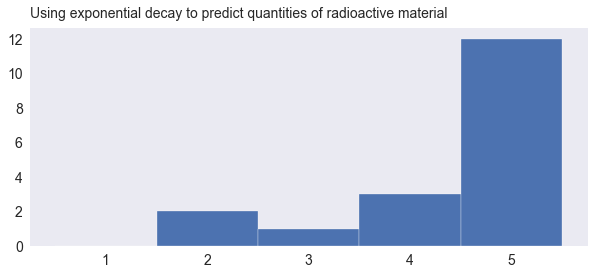


    
    


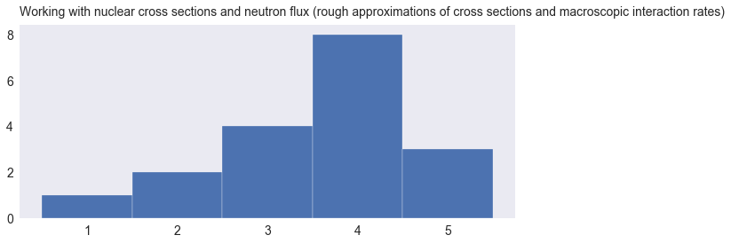


    
    


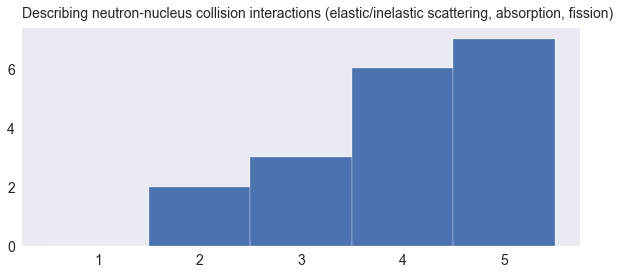


    
    


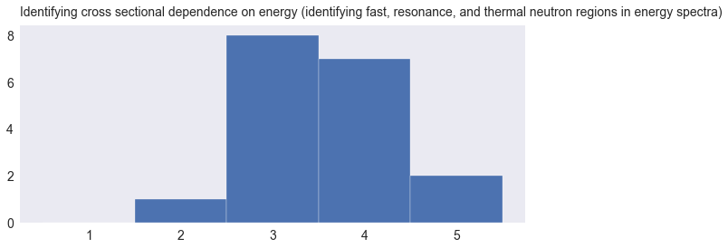


    
    


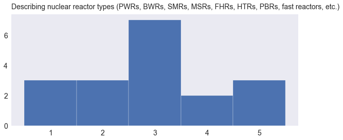


    
    


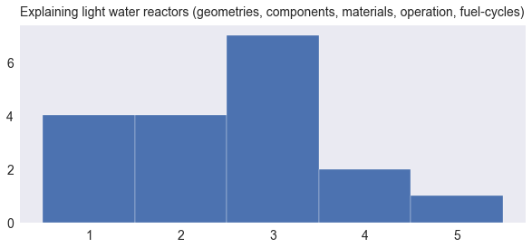


    
    


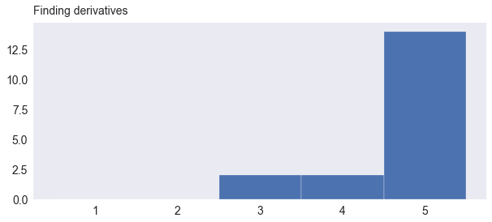


    
    


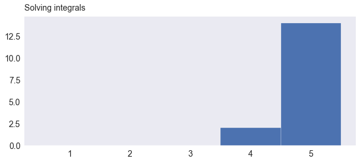


    
    


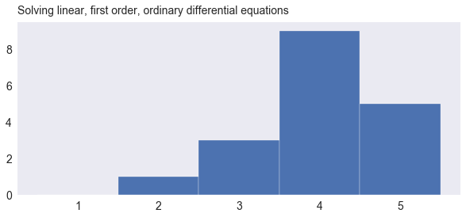


    
    


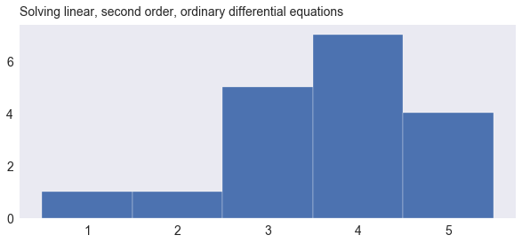


    
    


    
    


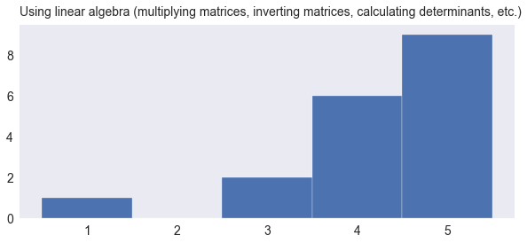


    
    


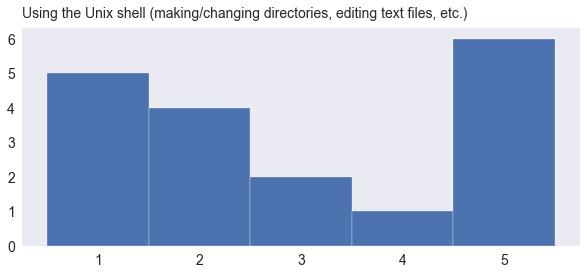


    
    


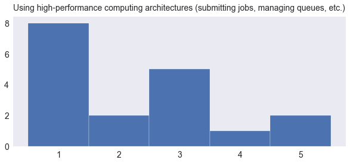


    
    


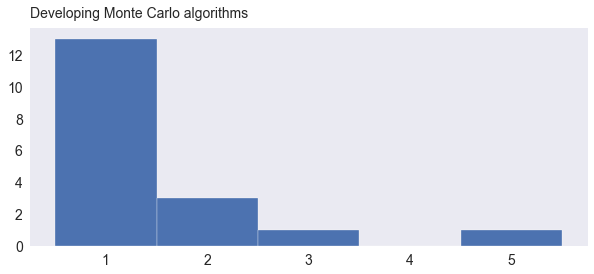


    
    


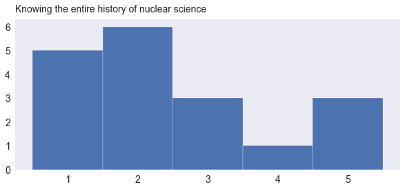


    
    

