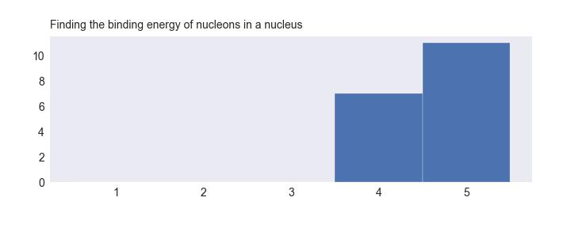
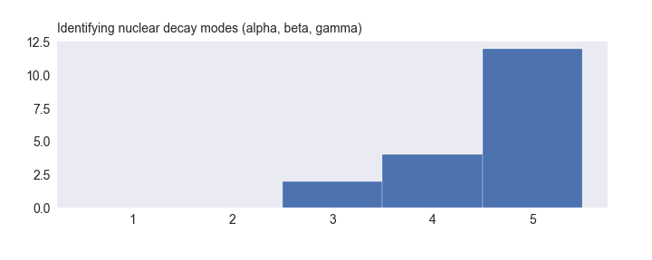
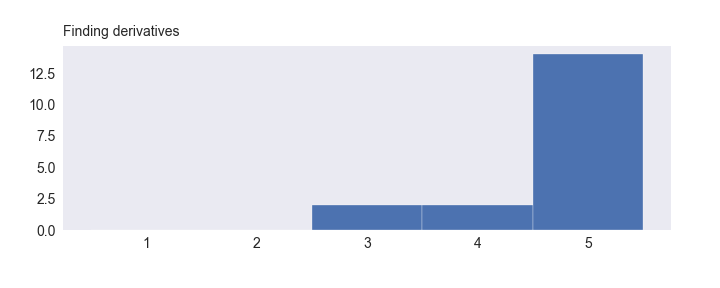
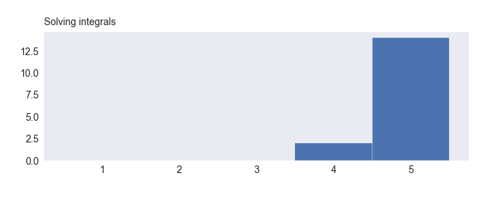
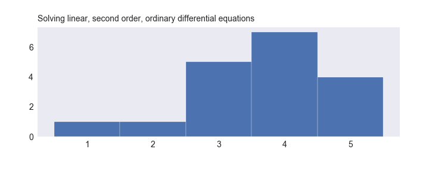
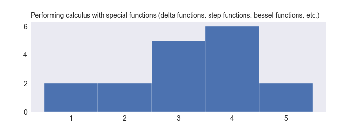
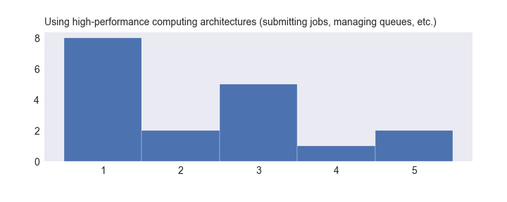

# NE 150 Pre-survey

Results of the anonymous pre-survey given to the UC Berkeley Nuclear Engineering 150 course, given in spring 2018. Students were asked to rate their level of familiarity with a set of topics and exercises corresponding to course prerequisites. The scale was:

1. I have never heard of this.
2. I have heard of this but don't know what it is
3. I learned about it this once but don't remember it
4. I can do this.
5. Do we have to learn this again?


```python
# Programmatic overhead
import numpy as np
import pandas as pd
import seaborn as sns
import IPython.display as IPd
from matplotlib import pyplot as plt

# Load data from a csv, downloaded from the Google Form
survey_data = pd.read_csv('presurvey_2018.csv')

# Loop through questions and plot scale
counter = 0
for question in survey_data.columns[1:]:
    fig,ax = plt.subplots(figsize=(10,4))
    fig.patch.set_facecolor('none')
    fig.tight_layout(pad=3.5)
    survey_data[question].hist(bins=[1,2,3,4,5,6],align='left',edgecolor='white')
    ax.text(0,1.05,s=question,fontsize=14,wrap=True,transform=ax.transAxes)
    ax.tick_params(labelsize='14')
    ax.grid(False)

    counter += 1
    plt.savefig('presurvey_2018_hists/survey_q{}.png'.format(counter))
    plt.close()

# Display the figures
for fig_num in range(1,counter+1):
    IPd.display(IPd.Image('presurvey_2018_hists/survey_q{}.png'.format(fig_num)))
    print('\n')
```





    
    





    
    


    
    


    
    


    
    


    
    


    
    


    
    





    
    





    
    


    
    





    
    





    
    


    
    


    
    





    
    


    
    


    
    

